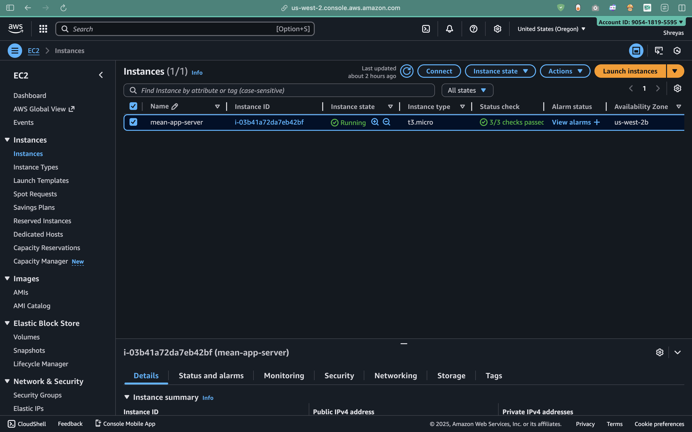
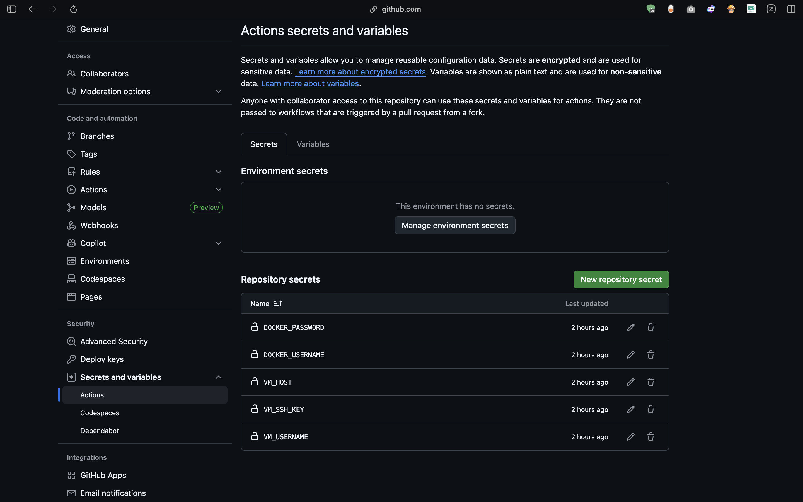
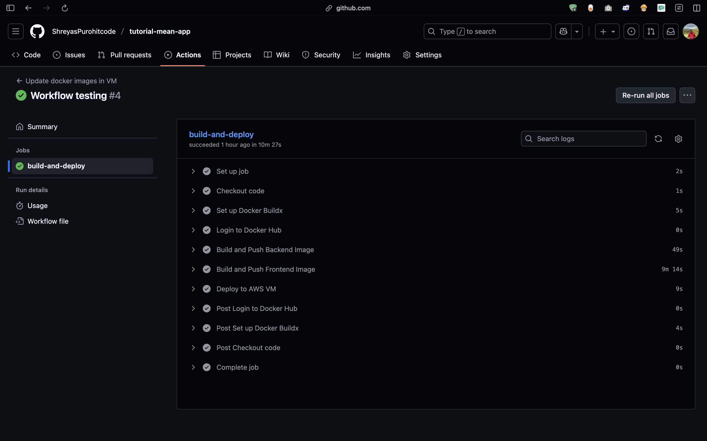
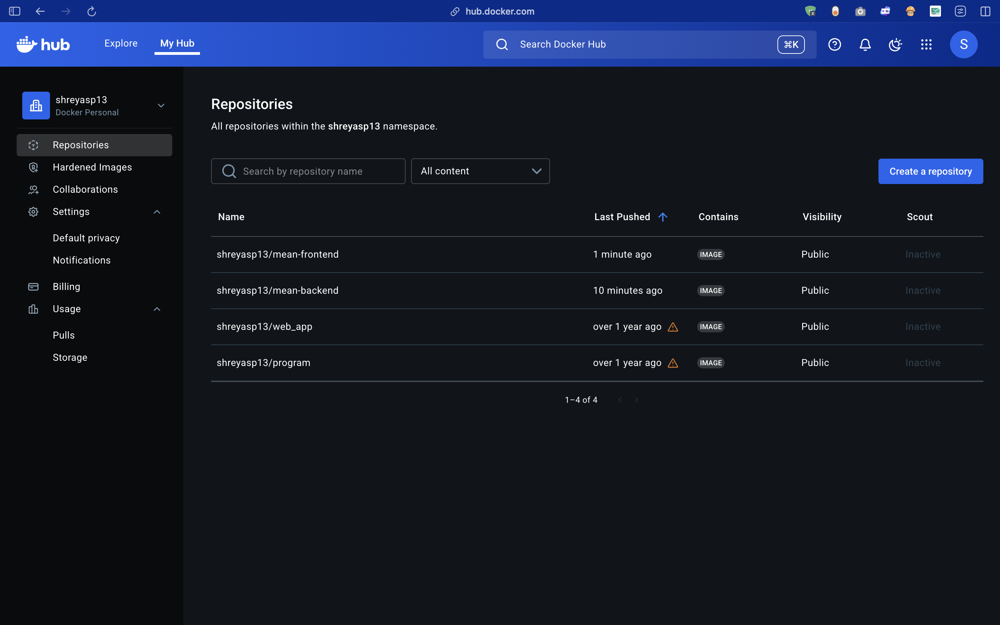
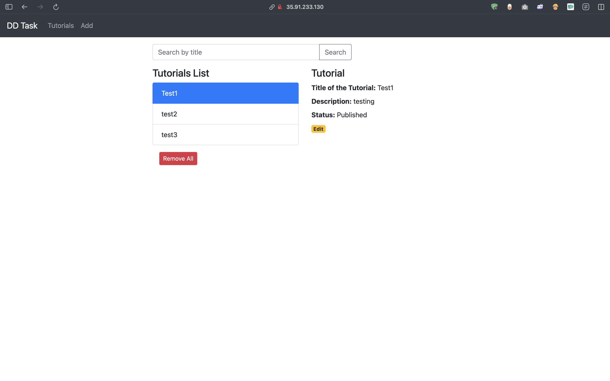
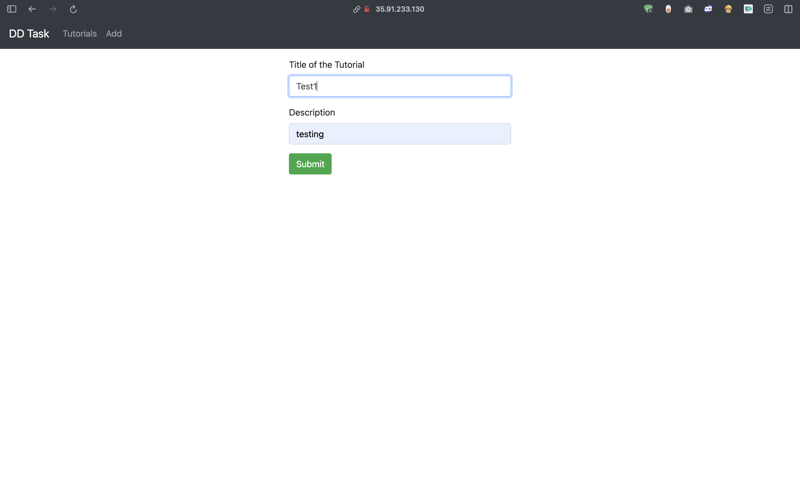

# MEAN Stack DevOps Deployment

Containerized MEAN stack application with automated CI/CD pipeline, deployed on AWS EC2 using Docker, GitHub Actions, and Nginx reverse proxy.

---

## 🏗️ Architecture

```
┌─────────────┐     Push Code       ┌──────────────────┐
│   GitHub    │ ──────────────────> │ GitHub Actions   │
│ Repository  │                     │    (CI/CD)       │
└─────────────┘                     └────────┬─────────┘
                                             │
                                             │ Build & Push
                                             ↓
                                    ┌──────────────────┐
                                    │   Docker Hub     │
                                    │  (Image Registry)│
                                    └────────┬─────────┘
                                             │
                                             │ Pull Images
                                             ↓
┌────────────────────────────────────────────────────────────┐
│                      AWS EC2 (Ubuntu)                      │
│                                                            │
│  ┌──────────────────────────────────────────────────────┐ │
│  │            Nginx Reverse Proxy (Port 80)             │ │
│  └──────────────┬───────────────────────┬────────────────┘ │
│                 │                       │                  │
│    ┌────────────▼────────────┐  ┌───────▼──────────┐      │
│    │  Frontend Container     │  │ Backend Container│      │
│    │   (Angular + Nginx)     │  │  (Node.js/Express)│     │
│    └─────────────────────────┘  └──────────┬────────┘      │
│                                            │                │
│                                  ┌─────────▼────────┐       │
│                                  │MongoDB Container │       │
│                                  └──────────────────┘       │
└────────────────────────────────────────────────────────────┘
```

---


## 📁 Project Structure

```
tutorial-mean-app/
├── backend/
│   ├── Dockerfile
│   └── app/config/db.config.js
├── frontend/
│   ├── Dockerfile
│   ├── nginx.conf
│   └── src/app/services/tutorial.service.ts
├── .github/workflows/deploy.yaml
├── docker-compose.yaml
├── nginx-proxy.conf
└── .env
```

---

## 🚀 Quick Setup

### 1. Local Setup

```bash
git clone https://github.com/YOUR_USERNAME/tutorial-mean-app.git
cd tutorial-mean-app
echo "DOCKER_USERNAME=your_username" > .env
```

### 2. Build Multi-Platform Images

```bash
# Setup buildx
docker buildx create --name multiplatform-builder --use

# Build & push backend
cd backend
docker buildx build --platform linux/amd64,linux/arm64 -t YOUR_USERNAME/mean-backend:latest --push .

# Build & push frontend
cd ../frontend
docker buildx build --platform linux/amd64,linux/arm64 -t YOUR_USERNAME/mean-frontend:latest --push .
```

---

## ☁️ AWS EC2 Setup

### Create Instance
1. **AMI**: Ubuntu Server 22.04 LTS
2. **Instance Type**: t2.medium
3. **Key Pair**: Create new (save `.pem` file)
4. **Security Group**: Allow SSH (22) and HTTP (80)
5. **Storage**: 20 GiB



### Install Docker

```bash
ssh -i ~/.ssh/your-key.pem ubuntu@YOUR_VM_IP

sudo apt update
sudo apt install -y docker.io
sudo systemctl start docker
sudo usermod -aG docker $USER

# Install Docker Compose
sudo curl -L "https://github.com/docker/compose/releases/latest/download/docker-compose-$(uname -s)-$(uname -m)" -o /usr/local/bin/docker-compose
sudo chmod +x /usr/local/bin/docker-compose
```

### Deploy Application

```bash
mkdir -p ~/mean-app && cd ~/mean-app
git clone https://github.com/YOUR_USERNAME/tutorial-mean-app.git .
echo "DOCKER_USERNAME=your_username" > .env
docker-compose up -d
```

---

## 🔄 CI/CD Pipeline

### GitHub Secrets Configuration

Add these secrets in: **Repository → Settings → Secrets and variables → Actions**

| Secret Name | Description |
|-------------|-------------|
| `DOCKER_USERNAME` | Docker Hub username |
| `DOCKER_PASSWORD` | Docker Hub password |
| `VM_HOST` | EC2 Public IPv4 address |
| `VM_USERNAME` | `ubuntu` |
| `VM_SSH_KEY` | Complete `.pem` file content |



### Workflow Stages

1. Checkout code
2. Build backend & frontend images (multi-platform)
3. Push to Docker Hub
4. SSH to VM and deploy



**Trigger**: Push to `main` branch

```bash
git push origin main
```

---

## 🐳 Docker Hub




## 📸 Screenshots



